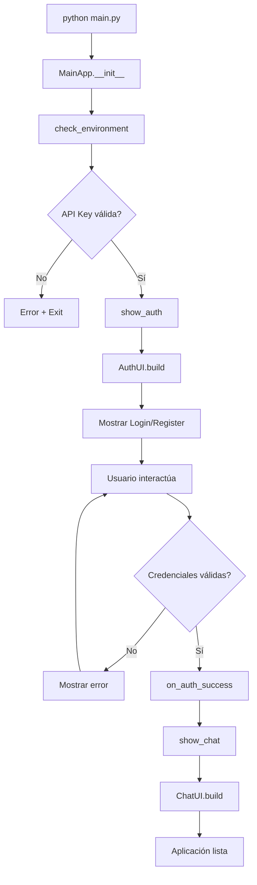
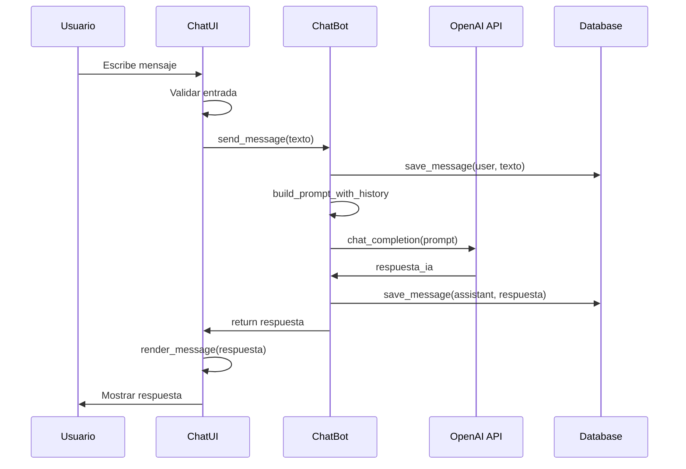
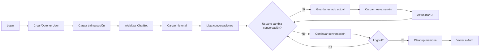
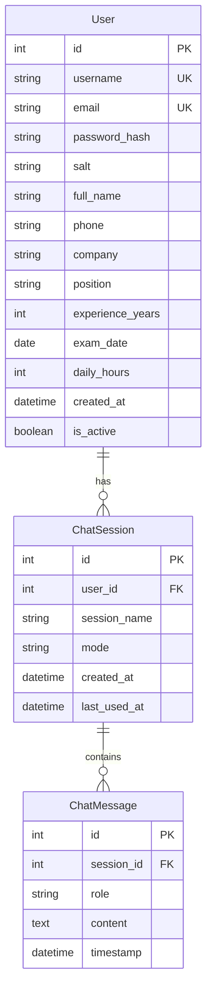

# 🏗️ Diseño de Arquitectura de Alto Nivel - Asistente para Certificación PMP

## 📌 1. Información General

### 1.1 Propósito del Documento
Este documento especifica el **diseño de arquitectura de alto nivel** del sistema **Asistente para Certificación PMP**. Define la estructura técnica, componentes, patrones de diseño, tecnologías y decisiones arquitectónicas que guían la implementación y evolución del sistema.

### 1.2 Alcance Arquitectónico
El diseño arquitectónico abarca:
- **Arquitectura de capas** y separación de responsabilidades
- **Componentes principales** y sus interacciones
- **Modelo de datos** y persistencia
- **Integración con servicios externos** (OpenAI API)
- **Patrones de diseño** aplicados
- **Consideraciones de seguridad** y rendimiento
- **Estrategias de despliegue** y empaquetado

### 1.3 Audiencia Técnica
- **Arquitectos de Software:** Para entender decisiones de diseño
- **Desarrolladores:** Para implementación y mantenimiento
- **DevOps:** Para configuración de despliegue
- **Tech Leads:** Para revisión técnica y evolución

---

## 🎯 2. Visión Arquitectónica General

### 2.1 Estilo Arquitectónico
El sistema implementa una **arquitectura por capas (Layered Architecture)** con elementos de **arquitectura modular**, siguiendo los principios de:

- **Separación de responsabilidades** (Separation of Concerns)
- **Bajo acoplamiento** entre componentes
- **Alta cohesión** dentro de cada módulo
- **Principio de responsabilidad única** (Single Responsibility Principle)
- **Inversión de dependencias** para testabilidad

### 2.2 Principios de Diseño Aplicados

**🔹 SOLID Principles:**
- **S - Single Responsibility:** Cada clase tiene una responsabilidad específica
- **O - Open/Closed:** Extensible para nuevos modos sin modificar código existente
- **L - Liskov Substitution:** Interfaces consistentes entre componentes
- **I - Interface Segregation:** Interfaces específicas por responsabilidad
- **D - Dependency Inversion:** Dependencias hacia abstracciones, no implementaciones

**🔹 DRY (Don't Repeat Yourself):**
- Configuración centralizada en variables de entorno
- Componentes de UI reutilizables
- Patrones de base de datos reutilizables

**🔹 KISS (Keep It Simple, Stupid):**
- Arquitectura directa y comprensible
- Tecnologías estándar y bien documentadas
- Flujos de datos lineales y predecibles

---

## 🏛️ 3. Arquitectura de Capas

### 3.1 Diagrama General de Capas

```
┌─────────────────────────────────────────────────────────────────┐
│                        CAPA DE APLICACIÓN                       │
├─────────────────────────────────────────────────────────────────┤
│  main.py - Coordinador Principal y Gestión del Ciclo de Vida   │
└─────────────────────────────────────────────────────────────────┘
                                   │
                                   ▼
┌─────────────────────────────────────────────────────────────────┐
│                      CAPA DE PRESENTACIÓN                       │
├─────────────────────────────────────────────────────────────────┤
│  ┌─────────────────┐                    ┌─────────────────┐     │
│  │   auth_ui.py    │                    │   chat_ui.py    │     │
│  │  Autenticación  │◄──────────────────►│      Chat       │     │
│  │   y Registro    │                    │   Principal     │     │
│  └─────────────────┘                    └─────────────────┘     │
└─────────────────────────────────────────────────────────────────┘
                                   │
                                   ▼
┌─────────────────────────────────────────────────────────────────┐
│                      CAPA DE LÓGICA DE NEGOCIO                  │
├─────────────────────────────────────────────────────────────────┤
│  ┌─────────────────┐                    ┌─────────────────┐     │
│  │     auth.py     │                    │   chatbot.py    │     │
│  │   Gestión de    │                    │   Motor de IA   │     │
│  │  Autenticación  │                    │  y Conversación │     │
│  └─────────────────┘                    └─────────────────┘     │
└─────────────────────────────────────────────────────────────────┘
                                   │
                                   ▼
┌─────────────────────────────────────────────────────────────────┐
│                        CAPA DE DATOS                            │
├─────────────────────────────────────────────────────────────────┤
│                          db/models.py                           │
│  ┌─────────────────────────────────────────────────────────┐   │
│  │                  DatabaseManager                        │   │
│  │  ├─ User (Usuarios y perfiles)                         │   │
│  │  ├─ ChatSession (Sesiones de conversación)            │   │
│  │  ├─ ChatMessage (Mensajes individuales)               │   │
│  │  └─ Operaciones CRUD y Analytics                      │   │
│  └─────────────────────────────────────────────────────────┘   │
└─────────────────────────────────────────────────────────────────┘
                                   │
                                   ▼
┌─────────────────────────────────────────────────────────────────┐
│                      CAPA DE INTEGRACIÓN                        │
├─────────────────────────────────────────────────────────────────┤
│  ┌─────────────────┐    ┌─────────────────┐    ┌──────────────┐ │
│  │   SQLite DB     │    │   OpenAI API    │    │ File System  │ │
│  │   (Local)       │    │   (Externa)     │    │ (.env, logs) │ │
│  └─────────────────┘    └─────────────────┘    └──────────────┘ │
└─────────────────────────────────────────────────────────────────┘
```

### 3.2 Responsabilidades por Capa

#### **Capa de Aplicación (main.py)**
```python
class MainApp:
    - Coordinación del ciclo de vida de la aplicación
    - Gestión de transiciones entre estados (login ↔ chat)
    - Verificación del entorno y configuración inicial
    - Manejo de callbacks entre componentes de UI
    - Configuración de ventana principal (Flet)
```

**Responsabilidades:**
- ✅ Punto de entrada único y bootstrapping
- ✅ Verificación de dependencias (API keys, Python version)
- ✅ Coordinación entre módulos de UI
- ✅ Gestión de estado global de la aplicación
- ✅ Manejo de shutdown graceful

#### **Capa de Presentación (UI)**
```python
class AuthUI:
    - Formularios de registro y login
    - Validación en tiempo real
    - Indicadores de fortaleza de contraseña
    - Animaciones y transiciones

class ChatUI:
    - Interfaz principal de chat
    - Sidebar de conversaciones
    - Navegación entre modos de estudio
    - Gestión de perfil de usuario
    - Responsive design
```

**Responsabilidades:**
- ✅ Renderizado y interacción del usuario
- ✅ Validación de entrada (primera capa)
- ✅ Gestión de estado de UI
- ✅ Comunicación con capa de lógica de negocio
- ✅ Feedback visual y UX

#### **Capa de Lógica de Negocio**
```python
class AuthManager:
    - Validación de credenciales
    - Hashing seguro de contraseñas
    - Análisis de fortaleza de contraseñas
    - Gestión de sesiones de usuario

class ChatBot:
    - Integración con OpenAI/LangChain
    - Gestión de conversaciones
    - Prompts especializados por modo
    - Análisis de progreso
```

**Responsabilidades:**
- ✅ Implementación de reglas de negocio
- ✅ Validación robusta (segunda capa)
- ✅ Procesamiento de datos
- ✅ Integración con servicios externos
- ✅ Caching y optimización

#### **Capa de Datos**
```python
class DatabaseManager:
    - Operaciones CRUD
    - Gestión de relaciones
    - Queries optimizadas
    - Análisis y métricas
```

**Responsabilidades:**
- ✅ Persistencia de datos
- ✅ Integridad referencial
- ✅ Optimización de consultas
- ✅ Manejo de transacciones
- ✅ Migración de esquemas

---

## 🔧 4. Componentes Principales y Módulos

### 4.1 Mapa de Componentes

```
Asistente-PMP/
├── 🎯 main.py                 # Coordinador Principal
├── 🔐 auth.py                 # Gestión de Autenticación  
├── 🖥️ auth_ui.py              # Interfaz de Autenticación
├── 💬 chat_ui.py              # Interfaz Principal de Chat
├── 🤖 chatbot.py              # Motor de IA y Conversación
├── 📁 db/
│   ├── __init__.py           # Inicialización del paquete
│   └── 🗃️ models.py           # Modelos de Datos y ORM
├── 📦 assets/                # Recursos estáticos
├── 🔧 setup.py               # Configuración automatizada
├── 📋 requirements.txt       # Dependencias Python
├── ⚙️ installer.iss          # Script de Inno Setup
├── 🚀 build-installer.ps1    # Automatización de build
└── 📖 *.md                   # Documentación
```

### 4.2 Análisis Detallado de Componentes

#### **🎯 main.py - Coordinador Principal**
```python
class MainApp:
    def __init__(self):
        self.authenticated_user = None    # Estado de autenticación
        self.page = None                  # Instancia de Flet Page
        self.auth_ui = None              # Componente de auth
        self.chat_ui = None              # Componente de chat
    
    # Métodos principales:
    check_environment()      # Verificación del entorno
    on_auth_success(user)    # Callback de login exitoso
    on_logout()              # Callback de logout
    show_auth()              # Mostrar interfaz de auth
    show_chat()              # Mostrar interfaz de chat
```

**Patrón de Diseño:** Coordinator/Mediator Pattern
**Dependencias:** `auth_ui`, `chat_ui`, `flet`, `dotenv`

#### **🔐 auth.py - Gestión de Autenticación**
```python
class AuthManager:
    def __init__(self):
        self.db_manager = DatabaseManager()
    
    # Métodos de validación y seguridad:
    register_user(username, email, password)     # Registro seguro
    login_user(username, password)               # Autenticación
    _validate_registration(data)                 # Validación robusta
    _hash_password(password, salt)               # SHA-256 + salt
    _generate_salt()                            # Generación criptográfica
    get_password_strength(password)              # Análisis de fortaleza
```

**Patrón de Diseño:** Service Layer Pattern
**Dependencias:** `hashlib`, `secrets`, `re`, `db.models`

#### **🖥️ auth_ui.py - Interfaz de Autenticación**
```python
class AuthUI:
    def __init__(self, page, on_success_callback):
        self.page = page
        self.on_success = on_success_callback
        self.auth_manager = AuthManager()
        self.current_mode = "login"      # login | register
    
    # Métodos de interfaz:
    build()                          # Construcción de UI
    toggle_mode()                    # Cambio login/registro
    on_password_change(e)            # Validación en tiempo real
    on_submit(e)                     # Procesamiento de forms
    show_loading(show)               # Estados de carga
```

**Patrón de Diseño:** MVP (Model-View-Presenter) Pattern
**Dependencias:** `flet`, `auth`, `threading`

#### **💬 chat_ui.py - Interfaz Principal**
```python
class ChatUI:
    def __init__(self, page, user, on_logout_callback):
        self.page = page
        self.user = user
        self.on_logout = on_logout_callback
        self.current_mode = None
        self.current_session = None
        self.chatbot = None
    
    # Métodos principales:
    build()                          # Construcción de UI completa
    send_message(message)            # Envío y procesamiento
    switch_mode(new_mode)            # Cambio entre modos PMP
    load_conversations()             # Carga de historial
    show_profile_form()              # Gestión de perfil
    toggle_sidebar()                 # Control de navegación
```

**Patrón de Diseño:** Component-based Architecture
**Dependencias:** `flet`, `chatbot`, `db.models`, `threading`

#### **🤖 chatbot.py - Motor de IA**
```python
class ChatBot:
    def __init__(self, user_id, mode="charlemos"):
        self.user_id = user_id
        self.mode = mode
        self.llm = ChatOpenAI(model="gpt-4o-mini", temperature=0.7)
        self.db_manager = DatabaseManager()
        self.conversation_history = []
        self.system_message = self._get_system_message_for_mode(mode)
    
    # Métodos de IA y conversación:
    send_message(message)                    # Procesamiento principal
    _get_system_message_for_mode(mode)       # Prompts especializados
    _load_conversation_history()             # Carga de contexto
    _save_message(role, content)             # Persistencia
    _get_analytics_context()                 # Datos para análisis
```

**Patrón de Diseño:** Strategy Pattern (para diferentes modos)
**Dependencias:** `langchain-openai`, `langchain`, `db.models`, `dotenv`

#### **🗃️ db/models.py - Capa de Datos**
```python
# Modelos de SQLAlchemy
class User(Base):
    # Campos de usuario y perfil
    id, username, email, password_hash, salt
    full_name, phone, company, position, experience
    exam_date, daily_hours, created_at, is_active

class ChatSession(Base):
    # Sesiones de conversación
    id, user_id, session_name, mode
    created_at, last_used_at

class ChatMessage(Base):
    # Mensajes individuales
    id, session_id, role, content, timestamp

class DatabaseManager:
    # Operaciones de base de datos
    create_user(), authenticate_user()
    get_user_sessions(), save_message()
    get_session_analytics()
```

**Patrón de Diseño:** Repository Pattern + ORM
**Dependencias:** `sqlalchemy`, `datetime`, `pytz`

---

## 🔄 5. Flujos de Datos y Control

### 5.1 Flujo de Inicio de Aplicación



### 5.2 Flujo de Conversación con IA



### 5.3 Flujo de Gestión de Sesiones



---

## 🏗️ 6. Patrones de Diseño Implementados

### 6.1 Patrones Estructurales

#### **🔹 Model-View-Presenter (MVP)**
```python
# Implementado en auth_ui.py y chat_ui.py
class AuthUI:  # Presenter
    def __init__(self, page, on_success_callback):
        self.view = page              # View (Flet components)
        self.model = AuthManager()    # Model (business logic)
    
    def on_submit(self, e):          # Presenter coordinates
        data = self._get_form_data()  # From View
        result = self.model.login_user(data)  # To Model
        self._update_view(result)     # Update View
```

#### **🔹 Repository Pattern**
```python
# Implementado en db/models.py
class DatabaseManager:
    def get_user_by_username(self, username):
        # Abstrae el acceso a datos
        return self.session.query(User).filter_by(username=username).first()
    
    def save_message(self, session_id, role, content):
        # Encapsula operaciones de persistencia
        message = ChatMessage(session_id=session_id, role=role, content=content)
        self.session.add(message)
        self.session.commit()
```

### 6.2 Patrones de Comportamiento

#### **🔹 Strategy Pattern**
```python
# Implementado en chatbot.py para diferentes modos
class ChatBot:
    def _get_system_message_for_mode(self, mode):
        strategies = {
            "charlemos": self._get_conversational_prompt,
            "estudiemos": self._get_structured_study_prompt,
            "evaluemos": self._get_evaluation_prompt,
            "simulemos": self._get_simulation_prompt,
            "analicemos": self._get_analytics_prompt
        }
        return strategies[mode]()
```

#### **🔹 Observer Pattern**
```python
# Implementado en main.py para callbacks
class MainApp:
    def __init__(self):
        self.auth_ui = AuthUI(page, self.on_auth_success)  # Observer
        self.chat_ui = ChatUI(page, user, self.on_logout)  # Observer
    
    def on_auth_success(self, user):  # Callback notification
        self.authenticated_user = user
        self.show_chat()
```

#### **🔹 Command Pattern**
```python
# Implementado implícitamente en UI event handlers
def on_submit(self, e):
    command = LoginCommand(self.model, form_data)
    result = command.execute()
    self._handle_result(result)
```

### 6.3 Patrones Creacionales

#### **🔹 Factory Pattern**
```python
# Para creación de componentes de UI
def create_chat_message(message, is_user):
    if is_user:
        return UserMessage(message)
    else:
        return AssistantMessage(message)

def create_mode_specific_prompt(mode):
    prompt_factory = {
        "charlemos": ConversationalPrompt,
        "estudiemos": StructuredPrompt,
        # ...
    }
    return prompt_factory[mode]()
```

#### **🔹 Singleton Pattern**
```python
# Para DatabaseManager (implícito por instancia única)
class DatabaseManager:
    _instance = None
    
    def __new__(cls):
        if cls._instance is None:
            cls._instance = super().__new__(cls)
        return cls._instance
```

---

## 🗄️ 7. Diseño de Base de Datos

### 7.1 Modelo Entidad-Relación



### 7.2 Decisiones de Diseño de BD

#### **🔹 SQLite como Motor de BD**
**Ventajas:**
- ✅ **Portabilidad:** Archivo único, fácil de distribuir
- ✅ **Zero-configuration:** No requiere servidor de BD
- ✅ **Performance:** Excelente para aplicaciones de escritorio
- ✅ **ACID compliant:** Transacciones seguras
- ✅ **SQL estándar:** Queries familiares y potentes

**Limitaciones aceptadas:**
- ⚠️ **Concurrencia:** Limitada, pero adecuada para aplicación de escritorio
- ⚠️ **Escalabilidad:** Suficiente para uso personal/pequeño equipo

#### **🔹 SQLAlchemy como ORM**
```python
# Configuración de la base de datos
DATABASE_URL = "sqlite:///chat_history.db"
engine = create_engine(DATABASE_URL)
SessionLocal = sessionmaker(bind=engine)

# Modelos con relaciones
class User(Base):
    __tablename__ = "users"
    
    sessions = relationship("ChatSession", back_populates="user")

class ChatSession(Base):
    __tablename__ = "chat_sessions"
    
    user = relationship("User", back_populates="sessions")
    messages = relationship("ChatMessage", back_populates="session")
```

### 7.3 Estrategias de Optimización

#### **🔹 Índices Estratégicos**
```sql
-- Búsqueda rápida de usuarios por credenciales
CREATE INDEX idx_users_username ON users(username);
CREATE INDEX idx_users_email ON users(email);

-- Consultas eficientes de sesiones por usuario
CREATE INDEX idx_sessions_user_id ON chat_sessions(user_id);
CREATE INDEX idx_sessions_last_used ON chat_sessions(last_used_at DESC);

-- Navegación rápida de mensajes por sesión
CREATE INDEX idx_messages_session_id ON chat_messages(session_id);
CREATE INDEX idx_messages_timestamp ON chat_messages(timestamp DESC);
```

#### **🔹 Lazy Loading y Paginación**
```python
# Carga perezosa de conversaciones
def get_user_sessions(self, user_id, limit=50):
    return self.session.query(ChatSession)\
        .filter_by(user_id=user_id)\
        .order_by(ChatSession.last_used_at.desc())\
        .limit(limit).all()

# Paginación de mensajes
def get_session_messages(self, session_id, offset=0, limit=100):
    return self.session.query(ChatMessage)\
        .filter_by(session_id=session_id)\
        .order_by(ChatMessage.timestamp)\
        .offset(offset).limit(limit).all()
```

---

## 🔐 8. Arquitectura de Seguridad

### 8.1 Estrategia de Autenticación

#### **🔹 Hashing de Contraseñas - SHA-256 + Salt**
```python
import hashlib
import secrets

def _generate_salt():
    """Genera salt criptográficamente seguro"""
    return secrets.token_hex(32)

def _hash_password(password, salt):
    """Hash seguro con SHA-256 + salt"""
    return hashlib.sha256((password + salt).encode()).hexdigest()

def authenticate_user(username, password):
    """Autenticación segura"""
    user = self.get_user_by_username(username)
    if user:
        hashed = self._hash_password(password, user.salt)
        return hashed == user.password_hash
    return False
```

#### **🔹 Validación Multicapa**
```python
# Capa 1: Frontend (UI) - Validación inmediata
def validate_password_strength(password):
    score = 0
    if len(password) >= 6: score += 1
    if re.search(r'[A-Za-z]', password): score += 1
    if re.search(r'[0-9]', password): score += 1
    return score

# Capa 2: Backend (Auth) - Validación robusta
def _validate_registration(self, data):
    errors = []
    if not re.match(r'^[a-zA-Z0-9_]{3,50}$', data['username']):
        errors.append("Username inválido")
    if not re.match(r'^[^@]+@[^@]+\.[^@]+$', data['email']):
        errors.append("Email inválido")
    # ...más validaciones
    return errors
```

### 8.2 Gestión de Secretos

#### **🔹 Variables de Entorno**
```bash
# .env file
OPENAI_API_KEY=sk-xxxxxxxxxxxxxxxxxxxxxxxxxxxxxxxx
DATABASE_URL=sqlite:///chat_history.db
SECRET_KEY=your-secret-key-here  # Para futuras features
```

#### **🔹 Verificación de Configuración**
```python
def check_environment(self):
    """Verifica configuración segura"""
    env_file = Path('.env')
    if not env_file.exists():
        return False
    
    api_key = os.getenv("OPENAI_API_KEY")
    if not api_key or api_key == "tu_clave_api_aqui":
        return False
    
    return True
```

### 8.3 Mitigación de Vulnerabilidades

#### **🔹 Prevención de Inyección SQL**
- ✅ **ORM SQLAlchemy:** Queries parametrizadas automáticas
- ✅ **Validación de entrada:** Sanitización de datos de usuario
- ✅ **Principio de menor privilegio:** Sin privilegios de admin en BD

#### **🔹 Gestión de Sesiones**
```python
class MainApp:
    def on_logout(self):
        """Logout seguro con cleanup"""
        # Limpiar datos sensibles de memoria
        if self.authenticated_user:
            self.authenticated_user = None
        
        # Limpiar referencias
        if hasattr(self, 'chat_ui'):
            self.chat_ui.cleanup()
        
        # Volver a pantalla de auth
        self.show_auth()
```

---

## 🌐 9. Integración con Servicios Externos

### 9.1 Integración OpenAI API

#### **🔹 Arquitectura de Integración**
```python
# Configuración centralizada
class ChatBot:
    def __init__(self, user_id, mode="charlemos"):
        self.llm = ChatOpenAI(
            model="gpt-4o-mini",      # Modelo optimizado
            temperature=0.7,          # Balance creatividad/precisión
            max_tokens=1500,          # Límite de respuesta
            timeout=30,               # Timeout de request
            api_key=self.api_key
        )
```

#### **🔹 Manejo de Errores Robusto**
```python
async def send_message(self, message):
    """Envío robusto con manejo de errores"""
    try:
        response = await self.llm.agenerate([message_list])
        return response.generations[0][0].text
    
    except openai.APIConnectionError:
        return "Error: No se pudo conectar con el servicio de IA"
    
    except openai.RateLimitError:
        return "Error: Límite de uso alcanzado, intenta más tarde"
    
    except openai.AuthenticationError:
        return "Error: API Key inválida o expirada"
    
    except Exception as e:
        logger.error(f"Error inesperado: {e}")
        return "Error: Problema temporal con el servicio"
```

#### **🔹 Optimización de Requests**
```python
# Gestión de contexto eficiente
def _build_conversation_context(self):
    """Construye contexto optimizado para la API"""
    messages = [self.system_message]
    
    # Limitar historial para optimizar tokens
    recent_history = self.conversation_history[-20:]  # Últimos 20 mensajes
    
    for msg in recent_history:
        if msg.role == "user":
            messages.append(HumanMessage(content=msg.content))
        else:
            messages.append(AIMessage(content=msg.content))
    
    return messages
```

### 9.2 Gestión de Conectividad

#### **🔹 Detección de Estado de Red**
```python
import requests

def check_internet_connection():
    """Verifica conectividad a internet"""
    try:
        response = requests.get("https://api.openai.com/v1/models", timeout=5)
        return response.status_code == 200
    except:
        return False

def get_connection_status():
    """Estado de conexión para UI"""
    if check_internet_connection():
        return "🟢 Conectado"
    else:
        return "🔴 Sin conexión"
```

#### **🔹 Funcionalidad Offline**
- ✅ **Navegación:** Cambio entre conversaciones
- ✅ **Historial:** Lectura de mensajes anteriores
- ✅ **Perfil:** Edición de datos de usuario
- ❌ **IA:** Nuevas consultas requieren conexión

---

## 📦 10. Estrategia de Despliegue y Empaquetado

### 10.1 Empaquetado con PyInstaller

#### **🔹 Configuración main.spec**
```python
# main.spec - Configuración de PyInstaller
a = Analysis(
    ['main.py'],
    pathex=[],
    binaries=[],
    datas=[
        ('assets', 'assets'),           # Incluir recursos
        ('.env.example', '.'),          # Plantilla de configuración
        ('db', 'db'),                   # Módulo de base de datos
    ],
    hiddenimports=[
        'flet',
        'langchain_openai',
        'sqlalchemy.dialects.sqlite',   # Driver SQLite
    ],
    hookspath=[],
    hooksconfig={},
    runtime_hooks=[],
    excludes=[],
    win_no_prefer_redirects=False,
    win_private_assemblies=False,
    cipher=None,
    noarchive=False,
)

pyz = PYZ(a.pure, a.zipped_data, cipher=None)

exe = EXE(
    pyz,
    a.scripts,
    a.binaries,
    a.zipfiles,
    a.datas,
    [],
    name='Asistente-PMP',
    debug=False,
    bootloader_ignore_signals=False,
    strip=False,
    upx=True,
    upx_exclude=[],
    runtime_tmpdir=None,
    console=False,                      # Aplicación gráfica
    disable_windowed_traceback=False,
    target_arch=None,
    codesign_identity=None,
    entitlements_file=None,
    icon='assets/icon.ico'              # Ícono de la aplicación
)
```

#### **🔹 Script de Build Automatizado**
```powershell
# build-installer.ps1
param(
    [switch]$CleanBuild = $false
)

function Build-Application {
    Write-Host "🔨 Construyendo aplicación con PyInstaller..."
    
    if ($CleanBuild) {
        Remove-Item "build", "dist" -Recurse -Force -ErrorAction SilentlyContinue
    }
    
    # Activar entorno virtual
    & ".\.venv\Scripts\Activate.ps1"
    
    # Instalar dependencias
    python -m pip install -r requirements.txt
    
    # Crear ejecutable
    python -m pyinstaller main.spec --clean --noconfirm
    
    # Verificar resultado
    if (Test-Path "dist\Asistente-PMP.exe") {
        Write-Host "✅ Ejecutable creado exitosamente"
        return $true
    } else {
        Write-Host "❌ Error al crear ejecutable"
        return $false
    }
}
```

### 10.2 Instalador con Inno Setup

#### **🔹 Script installer.iss**
```ini
[Setup]
AppName=Asistente para Certificación PMP
AppVersion=2.0.0
AppPublisher=Daneri Dahbar
DefaultDirName={autopf}\Asistente PMP
OutputDir=installer
OutputBaseFilename=Asistente-PMP-Installer-v2.0.0
SetupIconFile=assets\icon.ico
Compression=lzma
SolidCompression=yes

[Files]
Source: "dist\Asistente-PMP.exe"; DestDir: "{app}"; Flags: ignoreversion
Source: "assets\*"; DestDir: "{app}\assets"; Flags: ignoreversion recursesubdirs

[Icons]
Name: "{autoprograms}\Asistente PMP"; Filename: "{app}\Asistente-PMP.exe"
Name: "{autodesktop}\Asistente PMP"; Filename: "{app}\Asistente-PMP.exe"

[Run]
Filename: "{app}\Asistente-PMP.exe"; Description: "Ejecutar Asistente PMP"; Flags: nowait postinstall skipifsilent
```

### 10.3 Distribución y Versionado

#### **🔹 Estrategia de Releases**
```
Versión 2.0.0 - Actual
├── Asistente-PMP-v2.0.0-Windows.exe     # Instalador Windows
├── Asistente-PMP-v2.0.0-Portable.zip    # Versión portable
└── Asistente-PMP-v2.0.0-Source.zip      # Código fuente

Futuras versiones:
├── 2.1.0 - Nuevas funcionalidades
├── 2.0.1 - Parches y correcciones
└── 3.0.0 - Cambios arquitectónicos principales
```

#### **🔹 Automatización CI/CD (Propuesta futura)**
```yaml
# .github/workflows/build.yml
name: Build and Release
on:
  push:
    tags: ['v*']

jobs:
  build-windows:
    runs-on: windows-latest
    steps:
      - uses: actions/checkout@v3
      - name: Setup Python
        uses: actions/setup-python@v4
        with:
          python-version: '3.9'
      - name: Install dependencies
        run: pip install -r requirements.txt
      - name: Build with PyInstaller
        run: pyinstaller main.spec --clean
      - name: Create installer
        run: iscc installer.iss
```

---

## 🔄 11. Estrategias de Extensibilidad

### 11.1 Agregar Nuevos Modos de Estudio

#### **🔹 Pasos para Extensión**
```python
# 1. Agregar prompt especializado en chatbot.py
def _get_system_message_for_mode(self, mode):
    mode_prompts = {
        "charlemos": self._get_conversational_prompt,
        "estudiemos": self._get_structured_study_prompt,
        "evaluemos": self._get_evaluation_prompt,
        "simulemos": self._get_simulation_prompt,
        "analicemos": self._get_analytics_prompt,
        "nuevo_modo": self._get_nuevo_modo_prompt,  # ← Nuevo modo
    }
    return mode_prompts.get(mode, self._get_conversational_prompt)()

# 2. Implementar prompt específico
def _get_nuevo_modo_prompt(self):
    return SystemMessage(content="""
    Eres un especialista en [FUNCIÓN DEL NUEVO MODO].
    
    CARACTERÍSTICAS:
    - Explicación de funcionalidades específicas
    - Metodología particular
    - Casos de uso únicos
    
    COMPORTAMIENTO:
    - Instrucciones específicas de interacción
    - Formato de respuesta esperado
    - Criterios de éxito
    """)
```

```python
# 3. Actualizar UI en chat_ui.py
def create_navigation_menu(self):
    modes = [
        ("charlemos", "💬", "CHARLEMOS", ft.Colors.BLUE_600),
        ("estudiemos", "📚", "ESTUDIEMOS", ft.Colors.GREEN_600),
        ("evaluemos", "📝", "EVALUEMOS", ft.Colors.ORANGE_600),
        ("simulemos", "🏆", "SIMULEMOS", ft.Colors.PINK_600),
        ("analicemos", "📊", "ANALICEMOS", ft.Colors.PURPLE_600),
        ("nuevo_modo", "🎯", "NUEVO MODO", ft.Colors.TEAL_600),  # ← Nuevo modo
    ]
    # ... resto de la implementación
```

### 11.2 Integrar Nuevos Modelos de IA

#### **🔹 Abstracción de Proveedores**
```python
# Propuesta de arquitectura extensible
class AIProvider:
    """Interfaz abstracta para proveedores de IA"""
    def __init__(self, config):
        self.config = config
    
    async def generate_response(self, messages):
        raise NotImplementedError

class OpenAIProvider(AIProvider):
    """Implementación para OpenAI"""
    def __init__(self, config):
        super().__init__(config)
        self.client = ChatOpenAI(
            model=config.get("model", "gpt-4o-mini"),
            api_key=config.get("api_key")
        )

class AnthropicProvider(AIProvider):
    """Implementación para Anthropic Claude"""
    def __init__(self, config):
        super().__init__(config)
        # Configuración específica de Anthropic

# Factory para crear proveedores
def create_ai_provider(provider_type, config):
    providers = {
        "openai": OpenAIProvider,
        "anthropic": AnthropicProvider,
        # Futuros proveedores...
    }
    return providers[provider_type](config)
```

### 11.3 Expandir Base de Datos

#### **🔹 Sistema de Migraciones**
```python
# db/migrations.py
class Migration:
    """Sistema de migraciones para evolución de esquema"""
    
    @staticmethod
    def migrate_to_v2_1():
        """Migración para versión 2.1 - Agregar métricas de uso"""
        engine = create_engine(DATABASE_URL)
        
        # Crear nueva tabla
        engine.execute("""
        CREATE TABLE IF NOT EXISTS usage_metrics (
            id INTEGER PRIMARY KEY,
            user_id INTEGER REFERENCES users(id),
            session_date DATE,
            messages_sent INTEGER,
            study_time_minutes INTEGER,
            modes_used TEXT,
            created_at TIMESTAMP DEFAULT CURRENT_TIMESTAMP
        )
        """)
        
        # Crear índices
        engine.execute("CREATE INDEX idx_metrics_user_date ON usage_metrics(user_id, session_date)")

# Aplicación automática en startup
def apply_pending_migrations():
    current_version = get_schema_version()
    migrations = get_pending_migrations(current_version)
    
    for migration in migrations:
        migration.apply()
        update_schema_version(migration.version)
```

### 11.4 Plugin Architecture (Propuesta futura)

#### **🔹 Sistema de Plugins**
```python
# plugins/base.py
class PMPPlugin:
    """Clase base para plugins del sistema"""
    
    def __init__(self, app_context):
        self.app = app_context
    
    def initialize(self):
        """Inicialización del plugin"""
        pass
    
    def get_menu_items(self):
        """Items de menú que agrega el plugin"""
        return []
    
    def process_message(self, message, context):
        """Procesamiento de mensajes"""
        return None

# plugins/exam_simulator.py
class ExamSimulatorPlugin(PMPPlugin):
    def get_menu_items(self):
        return [
            ("exam_practice", "📋", "PRÁCTICA EXAMEN", ft.Colors.INDIGO_600)
        ]
    
    def process_message(self, message, context):
        if context.mode == "exam_practice":
            return self.handle_exam_message(message)
```

---

## 📊 12. Monitoreo y Métricas

### 12.1 Logging Estratégico

#### **🔹 Configuración de Logs**
```python
import logging
from pathlib import Path

def setup_logging():
    """Configuración de sistema de logging"""
    log_dir = Path("logs")
    log_dir.mkdir(exist_ok=True)
    
    # Configuración principal
    logging.basicConfig(
        level=logging.INFO,
        format='%(asctime)s - %(name)s - %(levelname)s - %(message)s',
        handlers=[
            logging.FileHandler(log_dir / "app.log"),
            logging.StreamHandler()  # También a consola en desarrollo
        ]
    )
    
    # Logger específico para métricas
    metrics_logger = logging.getLogger('metrics')
    metrics_handler = logging.FileHandler(log_dir / "metrics.log")
    metrics_logger.addHandler(metrics_handler)
    
    return logging.getLogger(__name__)
```

#### **🔹 Métricas de Performance**
```python
import time
from functools import wraps

def measure_performance(func):
    """Decorator para medir performance de funciones críticas"""
    @wraps(func)
    def wrapper(*args, **kwargs):
        start_time = time.time()
        result = func(*args, **kwargs)
        end_time = time.time()
        
        execution_time = end_time - start_time
        logger.info(f"Performance: {func.__name__} ejecutado en {execution_time:.2f}s")
        
        # Log crítico si la función es muy lenta
        if execution_time > 5.0:
            logger.warning(f"Slow function: {func.__name__} took {execution_time:.2f}s")
        
        return result
    return wrapper

# Aplicación en funciones críticas
@measure_performance
def send_message(self, message):
    # Implementación del envío de mensaje
    pass
```

### 12.2 Métricas de Uso

#### **🔹 Analytics de Usuario**
```python
class UserAnalytics:
    """Sistema de análisis de uso de la aplicación"""
    
    def __init__(self, db_manager):
        self.db = db_manager
    
    def track_session_start(self, user_id):
        """Registra inicio de sesión"""
        metrics = {
            'user_id': user_id,
            'action': 'session_start',
            'timestamp': datetime.now(),
            'data': {}
        }
        self._save_metric(metrics)
    
    def track_mode_usage(self, user_id, mode, duration):
        """Registra uso de modo específico"""
        metrics = {
            'user_id': user_id,
            'action': 'mode_usage',
            'timestamp': datetime.now(),
            'data': {
                'mode': mode,
                'duration_seconds': duration
            }
        }
        self._save_metric(metrics)
    
    def generate_usage_report(self, user_id):
        """Genera reporte de uso para el usuario"""
        # Consultar datos y generar insights
        pass
```

---

## 🚀 13. Roadmap Técnico y Evolución

### 13.1 Versiones Planificadas

#### **🔹 Versión 2.1.0 - Mejoras de UX**
**Características técnicas:**
- [ ] **Sistema de temas:** Dark/Light mode
- [ ] **Configuración avanzada:** Personalización de IA
- [ ] **Exportación de datos:** PDF de conversaciones
- [ ] **Métricas mejoradas:** Dashboard de progreso más rico
- [ ] **Plugin básico:** Sistema para extensiones simples

**Cambios arquitectónicos:**
- Refactoring de UI para soporte de temas
- Sistema de configuración más robusto
- Mejoras en el modelo de datos

#### **🔹 Versión 2.2.0 - Funcionalidades Avanzadas**
- [ ] **Sincronización en la nube:** Backup automático
- [ ] **Modo colaborativo:** Sesiones compartidas
- [ ] **IA multimodal:** Soporte para imágenes
- [ ] **Integración con calendario:** Recordatorios de estudio

#### **🔹 Versión 3.0.0 - Arquitectura Distribuida**
- [ ] **Microservicios:** Separación de componentes
- [ ] **API REST:** Interfaz para integraciones
- [ ] **Aplicación web:** Versión browser-based
- [ ] **Móvil:** Apps nativas iOS/Android

### 13.2 Consideraciones de Migración

#### **🔹 Compatibilidad hacia atrás**
- Migración automática de base de datos
- Importación de configuraciones antiguas
- Preservación de datos de usuario

#### **🔹 Estrategia de actualización**
- Updates incrementales automáticos
- Notificaciones de nuevas versiones
- Rollback seguro en caso de problemas

---

## 📋 14. Conclusiones y Recomendaciones

### 14.1 Fortalezas Arquitectónicas

#### **🔹 Diseño Sólido**
- ✅ **Separación clara de responsabilidades** facilita mantenimiento
- ✅ **Modularidad alta** permite extensiones sin impacto
- ✅ **Tecnologías maduras** garantizan estabilidad
- ✅ **Seguridad robusta** protege datos de usuarios
- ✅ **Performance optimizado** para aplicación de escritorio

#### **🔹 Escalabilidad**
- ✅ **Arquitectura extensible** para nuevos modos de estudio
- ✅ **Base de datos optimizada** para crecimiento de datos
- ✅ **Integración flexible** con servicios de IA
- ✅ **Empaquetado robusto** para distribución profesional

### 14.2 Áreas de Mejora

#### **🔹 Mejoras Técnicas**
- 🔄 **Testing automatizado:** Implementar suite de pruebas completa
- 🔄 **CI/CD pipeline:** Automatizar build y distribución
- 🔄 **Monitoreo avanzado:** Métricas en tiempo real
- 🔄 **Documentación técnica:** API documentation y guías de desarrollo

#### **🔹 Optimizaciones**
- 🔄 **Cache inteligente:** Reducir latencia de IA
- 🔄 **Compresión de datos:** Optimizar almacenamiento
- 🔄 **Lazy loading avanzado:** Mejorar tiempo de inicio
- 🔄 **Threading mejorado:** Operaciones más fluidas

### 14.3 Recomendaciones de Implementación

#### **🔹 Desarrollo**
1. **Mantener principios SOLID** en todas las nuevas funcionalidades
2. **Implementar testing** antes de agregar features complejas
3. **Documentar decisiones** arquitectónicas importantes
4. **Revisar performance** regularmente con profiling

#### **🔹 Operación**
1. **Monitorear métricas** de uso y performance
2. **Actualizar dependencias** de seguridad regularmente
3. **Backup automático** de datos críticos
4. **Planificar capacity** según crecimiento de usuarios

---

**Documento generado:** $(date)  
**Versión del proyecto:** 2.0.0 con Autenticación  
**Versión del documento:** 1.0  
**Autor:** Sistema de Análisis Arquitectónico

---

*Este documento de arquitectura debe ser revisado y actualizado con cada versión mayor del sistema para mantener la coherencia entre diseño e implementación.* 